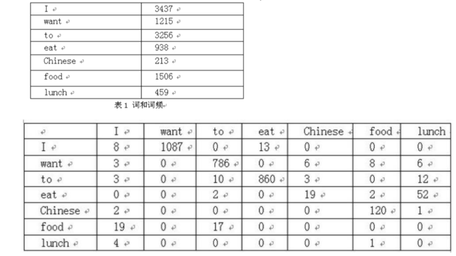
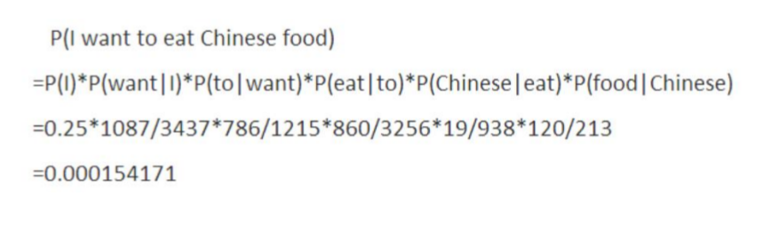
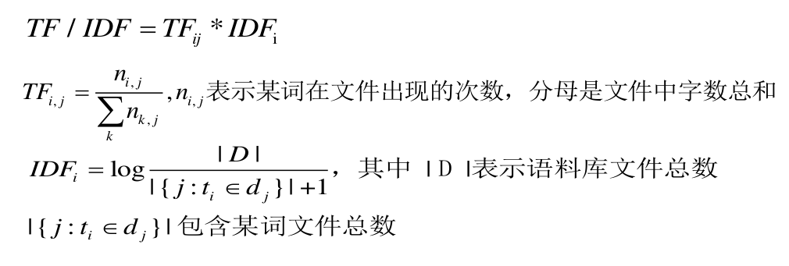
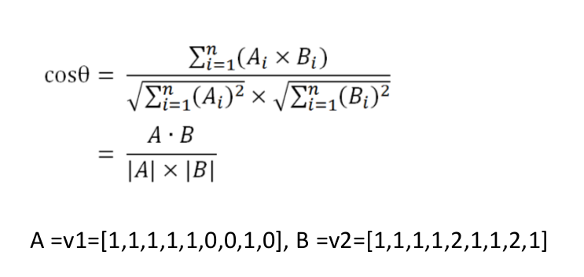

# 5.1 N-GRAM介绍
N-Gram是基于一个假设:第n个词出现不前n-1个词相关,而不其他
任何词不相关。(这也是隐马尔可夫当中的假设。)整个句子出现的概
率就等于各个词出现的概率乘积。各个词的概率可以通过语料中统计计
算得到。假设句子T是有词序列w1,w2,w3...wn组成,用公式表示N-
Gram语言模型如下:

• P(T)=P(w1)*p(w2)*p(w3)***p(wn)=p(w1)*p(w2|w1)*p(w3|w1w2)**
*p(wn|w1w2w3...)

```
一般常用的N-Gram模型是Bi-Gram和Tri-Gram。分别用公式表示如下:

• Bi-Gram:
P(T)=p(w1|begin)*p(w2|w1)*p(w3|w2)***p(wn|wn-1)

• Tri-Gram:
P(T)=p(w1|begin1,begin2)*p(w2|w1,begin1)*p(w3|w2w1)***p(wn|
wn-1,wn-2)

• 注意上面概率的计算方法:P(w1|begin)=以w1为开头的所有句子/句
子总数;p(w2|w1)=w1,w2同时出现的次数/w1出现的次数。以此类推。
```

### 举个经典的二元语言模型(Bi-gram)例子:



二元语言模型实例(左为语料库中词频和词序列,右为“I want to eat
Chinese food”概率计算过程)：



### N-GRAM的用处
```
N-Gram(有时也称为N元模型)是自然语言处理中一个非常重要的概
念,通常在NLP中,人们基于一定的语料库,可以利用N-Gram来预计
或者评估一个句子是否合理。

• N-gram对中文词性标注(part of speech, POS)、中文分词(Word
Segmentation)有很好的效果。中文分词和POS是中文文本分析中非
常重要的一环,因此在此作为N-gram的应用简要介绍。此外,基于N-
gram还出现了更多有价值的语言模型,如NNLM、CBOW等。
```
# 5.2 N-GRAM生成词语对

看代码

# 5.3 TF-IDF算法介绍及应用

### 概念
```
• TF/IDF(term frequency–inverse document frequency)用以评估字词
对于一个文件集其中一份文件的重要程度。==字词的重要性==随着它在文件中出
现的次数成正比增加,随着它在语料库中出现的频率下降。

• 词频 (term frequency, TF) 词语在文件中出现的次数,一般进行归一化,防
止长文件数字过大。

• 逆向文件频率 (inverse document frequency, IDF) 是一个词语普遍重要性
的度量。总文件数除以包含该词语文件数,再将得到的商取对数。

• 结论:在某特定文件内的高频率词语,但是该词语在整个文件集合中在较少
文件中出现,TF-IDF值较高。
```

### 公式



### 应用举例

• 1)关键词提取

• 2)句子相似度计算

• 3)其他算法的前置算法

### TF-IDF文章相似度计算流程:

• A、使用TF-IDF算法,分别找出两篇文章的关键词;

• B、分别取每篇文章TF/IDF值top15(戒者其他值)的词,合并成一个集合,计算该集合下,每篇文章关键词的相对词频;

• C、分别生成两篇文章的词频向量;

• D、计算两个向量的余弦相似度,值越大就表示越相似。

```
• S1:香蕉和苹果都是水果。
• S2:香蕉和苹果都是水果,也是常见的水果。
• 1)分词:S1:香蕉/和/苹果/都/是/水果/。 S2:香蕉/和/苹果/都/是
/水果/,/也/是/常见/的/水果/。
• 2)合并所有的词为集合(无重复词)(香蕉 和 苹果 都 是 常见 的
水果 也)
• 3)计算每个句子词频向量:
• v1=[1,1,1,1,1,0,0,1,0],v2=[1,1,1,1,2,1,1,2,1]
• 4)计算余弦相似度
```

