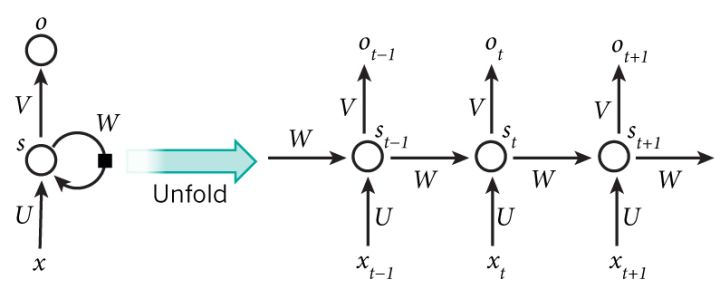
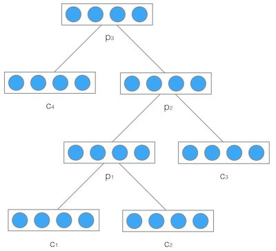

# 8.1 循环神经网络与递归神经网络的区别与联系
## 1.循环神经网络（recurrent neural network）是时间上的展开，处理的是序列结构的信息，是有环图，模型结构如下：

>recurrent: 时间维度的展开，代表信息在时间维度从前往后的的传递和积累，可以类比markov假设，后面的信息的概率建立在前面信息的基础上，在神经网络结构上表现为后面的神经网络的隐藏层的输入是前面的神经网络的隐藏层的输出；

## 2.递归神经网络（recursive neural network）递归神经网络是空间上的展开，处理的是树状结构的信息，是无环图，模型结构如下：

>recursive: 空间维度的展开，是一个树结构，比如nlp里某句话，用recurrent neural network来建模的话就是假设句子后面的词的信息和前面的词有关，而用recurxive neural network来建模的话，就是假设句子是一个树状结构，由几个部分(主语，谓语，宾语）组成，而每个部分又可以在分成几个小部分，即某一部分的信息由它的子树的信息组合而来，整句话的信息由组成这句话的几个部分组合而来。

# 8.2 循环神经网络（recurrent neural network）
RNN引入“记忆”的概念;递归指其每一个元素都执行相同的任务,但是输出依赖于输入和“记忆”

https://zybuluo.com/hanbingtao/note/541458

## RNN的梯度爆炸和消失问题

当η<1时,就会出现梯度消失问题,而当η>1时,梯度爆炸也就产生了。

通常来说，梯度爆炸更容易处理一些。因为梯度爆炸的时候，我们的程序会收到NaN错误。我们也可以设置一个梯度阈值，当梯度超过这个阈值的时候可以直接截取。

梯度消失更难检测，而且也更难处理一些。总的来说，我们有三种方法应对梯度消失问题：

>1.合理的初始化权重值。初始化权重，使每个神经元尽可能不要取极大或极小值，以躲开梯度消失的区域。

>2.使用relu代替sigmoid和tanh作为激活函数。原理请参考上一篇文章零基础入门深度学习(4) - 卷积神经网络的激活函数一节。

>3.使用其他结构的RNNs，比如长短时记忆网络（LTSM）和Gated Recurrent Unit（GRU），这是最流行的做法。我们将在以后的文章中介绍这两种网络。

代码：8_chapter/8.2循环神经网络

# 8.3 递归神经网络（recursive neural network）

https://zybuluo.com/hanbingtao/note/626300

代码：8_chapter/8.3递归神经网络

# 8.4 长短时记忆网络(LSTM)

在8.1中，我们介绍了循环神经网络以及它的训练算法。我们也介绍了循环神经网络很难训练的原因，这导致了它在实际应用中，很难处理长距离的依赖。在本文中，我们将介绍一种改进之后的循环神经网络：长短时记忆网络(Long Short Term Memory Network, LSTM)，它成功的解决了原始循环神经网络的缺陷，成为当前最流行的RNN，在语音识别、图片描述、自然语言处理等许多领域中成功应用。

但不幸的一面是，LSTM的结构很复杂，因此，我们需要花上一些力气，才能把LSTM以及它的训练算法弄明白。在搞清楚LSTM之后，我们再介绍一种LSTM的变体：GRU (Gated Recurrent Unit)。 它的结构比LSTM简单，而效果却和LSTM一样好，因此，它正在逐渐流行起来。最后，我们仍然会动手实现一个LSTM。

需要注意的一点是：LSTM和GRU都是循环神经网络的一种。

本节分两个部分，第一部分是原理（包括基于numpy的一个实现，帮助理解原理），第二部分是应用。

## 8.4.1 原理介绍及numpy实现

首先介绍一下原理及实现
https://zybuluo.com/hanbingtao/note/581764

代码：8_chapter/8.4.1递归神经网络

## 8.4.2 基于tensorflow的cnn/lstm的文本分类实现

其次介绍一下使用tensorflow实现的基于cnn/lstm文本分类

每个word经过embedding之后,进入LSTM层,这里LSTM是标准的LSTM,然后经过一个时间序列得到的t个隐藏LSTM神经单元的向量,这些向量经过mean pooling层之后,可以得到一个向量h,然后紧接着是一个简单的逻辑斯蒂回归层(戒者一个softmax层)得到一个类别分布向量。

代码：8_chapter/8.4.2递归神经网络
