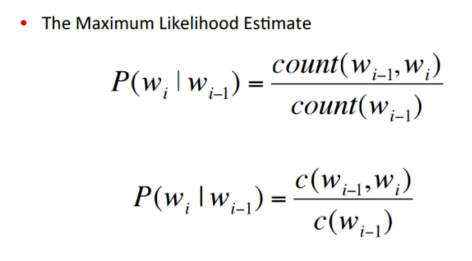
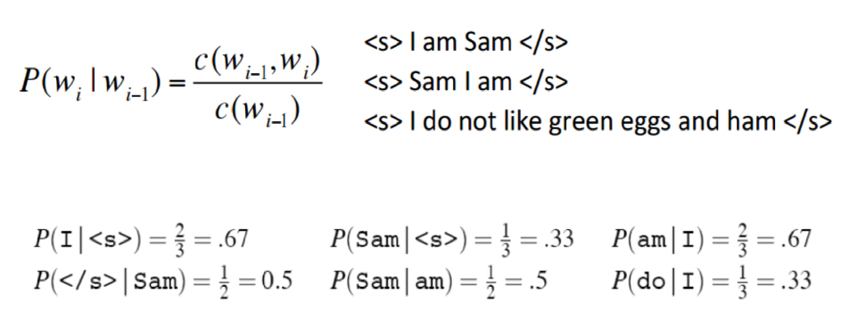
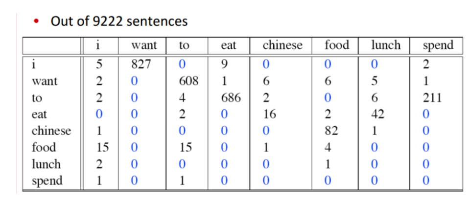
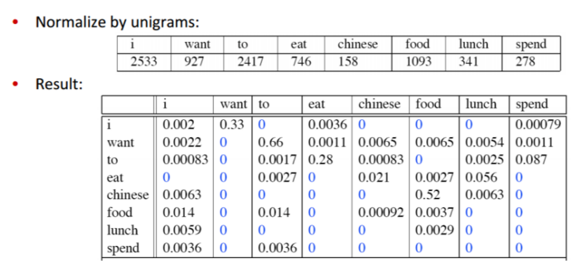
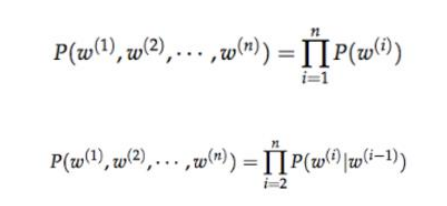
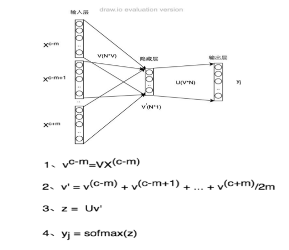
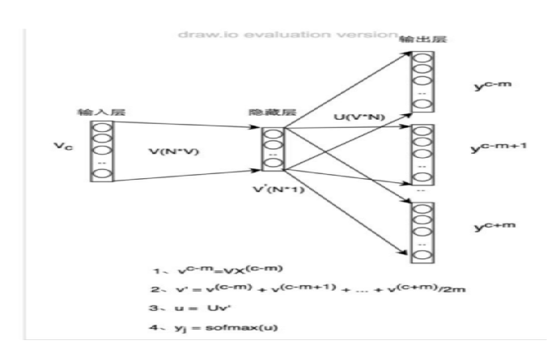
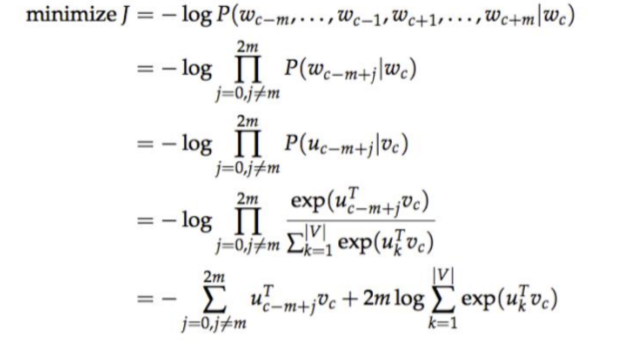

# 6.1 语言模型
词向量模型与语言模型非常紧密地交织在一起。语言模型的质量评估是基于它们对词语用概率分布的表征能力。事实上,许多最先进的词向量模型都在攻坚的任务就是已有一串词语序列,预测下一个出现的词语将会是什么。

## 语言模型是干嘛的?chunking

语言模型可以计算任何句子的概率。

例如,“I love you too”的概率是多少?用数学语言表述,NN元语言模型(bi-gram model)根据一个词语的前N−1个词语,来计算这个词语的概率。

如果我们有了一个2元模型,“I love you”的概率就等亍P(I)×P(love|I)×P(you|love)P(I)(最后一段解释原因)。

2元模型用一个矩阵来表示,比如对于一个有10000个词的语料库,这个语料库的2元模型就是一个10000×10000的矩阵,第mm行第nn列表示在第mm个词语的条件下,第nn个词语出现的概率,即第mm个词语后面跟着第nn个词语的概率。如果我们知道了语言模型,我们就可以像计算“I love you”那样,计算任何一个句子的概率。

## 语言模型有什么用?

语言模型在自然语言处理中占有重要的地位,在语音识别,机器翻译,汉语自动分词和句法分析等都有应用。因为这些模型都会有噪声,都会有几种不同的结果等着我们去选择,这时候就需要知道每种结果的概率,来帮助我们选择。

为什么叫“语言模型”?

因为这是统计学意义上的模型,又跟语言相关,所以叫语言模型。统计模型指一系列分布,参数模型指一系列可用有限个参数表示的模型。语言模型就是一种参数模型,它的参数是矩阵的所有cell。

## 如何计算语言模型的参数?

参数无法精确计算,只能大概估计。这里用的方法是极大似然估计。对于某个语料库,极大似然估计的意思是,哪个语言模型(什么样的参数)最有可能产生这个语料库呢?把这个问题分解成许多个小问题:当P(you|I)是多少时(love和I可以换成别的所有的词),最有可能产生这个语料库呢?自然而然我们会想到,统计语料库里一共有多少个I,一共有多少个I love,然后做一下除法,就得到了我们想要的概率,这个概率最有可能产生这个语料库。我们对这个语料库里所有的词对做相同的计数和除法,就得到了我们想要的参数,也就得到了这个语料库的语言模型。

### 原因:马尔科夫假设

为什么I love you的概率可以通过P(I)×P(love|I)×P(you|love)P(I)计算呢?

其实这么算只是在某个假设下的近似计算,这个假设就是一个词出现的概率只取决于它前N−1个词。所以在二元模型下,I love you的概率可以那么算。

以此类推,三元模型下,I love you的概率就要这么算了:P(I)×P(love|I)×P(you|I,love)P(I)

## 例子：计算bigram 概率

### 公式：



### 三句话的例子：



### 9222句话的例子：





# 6.2 词向量

## • 词向量的来历

自上世纪90年代开始,特征空间模型就应用于分布式语言理解中。在当时,许多模型用连续型的表征来表示词语,包括潜在语义分析(Latent Semantic Analysis)和潜在狄利克雷分配(Latent Dirichlet Allocation)模型。这篇文章详细介绍了词向量方法在那个阶段的发展。

Bengio等人在2003年首先提出了词向量的概念,当时是将其与语言模型的参数一并训练得到的。Collobert和Weston则第一次正式使用预训练的词向量。Collobert和Weston的那篇里程碑式的论文A unified architecture for natural language processing 不仅将词向量方法作为处理下游任务的有效工具,而且还引入了神经网络模型结构,为目前许多方法的改进和提升奠定了基础。

词向量的真正推广要归因于Mikolov等人于2013年开发的Word2vec,word2vec可以训练和使用词向量。在2014年,Pennington等人发布了GloVe,这是一套预训练得到的完整词向量集,它标志着词向量方法
已经成为了NLP领域的主流。

词向量方法是无监督式学习的少数几个成功应用之一。它的优势在于不需要人工标注语料,直接使用未标注的文本训练集作为输入。输出的词向量可以用于下游的业务处理。

一般来说,神经网络将词表中的词语作为输入,输出一个低维度的向量表示这个词语,然后用反向传播的方法不断优化参数。输出的低维向量是神经网络第一层的参数,这一层通常也称作Embedding Layer。

生成词向量的神经网络模型分为两种,一种是像word2vec,这类模型的目的就是生成词向量,另一种是将词向量作为副产品产生,两者的区别在于计算量不同。若词表非常庞大,用深层结构的模型训练词向量需要许多计算资源。这也是直到2013年词向量才开始被广泛用于NLP领域的原因。计算复杂度是使
用词向量方法需要权衡的一个因素,我们在后面还有讨论。

## • 什么是 Word2vec

在聊 Word2vec 之前,先聊聊 NLP (自然语言处理)。NLP 里面,最细粒度的是词语,词语组成句子,句子再组成段落、篇章、文档。所以处理 NLP 的问题,首先就要拿词语开刀。

举个简单例子,判断一个词的词性,是动词还是名词。用机器学习的思路,我们有一系列样本(x,y),这里 x 是词语,y 是它们的词性,我们要构建 f(x)->y 的映射,但这里的数学模型 f(比如神经网络、SVM)
只接受数值型输入,而 NLP里的词语,是人类的抽象总结,是符号形式的(比如中文、英文、拉丁文等等),所以需要把他们转换成数值形式,或者说——嵌入到一个数学空间里,这种嵌入方式,就是词嵌入(word
embedding),而 Word2vec,就是词嵌入( word embedding) 的一种。

### • Word2vec 的Skip-gram 和 CBOW 模型
• 如果是用一个词语作为输入,来预测它周围的上下文,那这个模型叫做
『Skip-gram 模型』

• 而如果是拿一个词语的上下文输入,来预测这个词语本身,则是
『CBOW 模型』

### • CBOW 和Skip-gram 模型迭代的方法
目前基于迭代的方法获取词向量大多是基于语言模型的训练得到的,对
于一个合理的句子,希望语言模型能够给予一个较大的概率,同理,对
于一个不合理的句子,给予较小的概率评估。具体的形式化表示如下:





如上图所示，第一个公式:一元语言模型,假设当前词的概率只和自己有关;第二个
公式:二元语言模型,假设当前词的概率和前一个词有关。那么问题来
了,如何从语料库中学习给定上下文预测当前词的概率值呢?

A、Continuous Bag of Words Model(CBOW)

给定上下文预测目标词的概率分布,例如,给定{The,cat,(),over,the,puddle}预测中心词是jumped的概率,模型的结构如下:



B、Skip-Gram Model

下图Skip-gram 的网络结构了,x 就是上面提到的 one-hot encoder 形式的输入,y 是在这 V (字典)个词上输出的概率,我们希望跟真实的y 的 one-hot encoder 一样。


https://www.leiphone.com/news/201706/PamWKpfRFEI42McI.html

隐层的激活函数其实是线性的,相当于没做任何处理(这也是Word2vec 简化之前语言模型的独到之处),我们要训练这个神经网络,用反向传播算法,本质上是链式求导 ,在此不展开说明了,

当模型训练完后,最后得到的其实是神经网络的权重,比如现在输入一个 x 的 one-hot encoder: [0,1,0,...,0],对应刚说的那个词语『吴彦祖』,则在输入层到隐含层的权重里,叧有对应 1 这个位置的权重被激活,这些权重的个数,跟隐含层节点数是一致的,从而这些权重组成一个向量 vx 来表示x,而因为每个词语的 one-hot encoder 里面 1 的位置是不同的,所以,这个向量 vx 就可以用来唯一表示 x。

word2vec对这个模型做了改进,首先,对于从输入层到隐藏层的映射,没有采取神经网络的线性变换加激活函数的方法,而是采用简单的对所有输入词向量求和并取平均的方法。比如输入的是三个4维词向量:
(1,2,3,4),(9,6,11,8),(5,10,7,12),那么我们word2vec映射后的词向量就是(5,6,7,8)。由于这里是从多个词向量变成了一个词向量。

#### • Skip-gram公式推导



对于skip-ngram模型也需要设定一个目标函数,随后采用优化方法找到该model的最佳参数解,目标函数如下:




# word2vec原理及代码

## 1.word2vec原理

理解 Word2Vec 之 Skip-Gram 模型
https://zhuanlan.zhihu.com/p/27234078
> 这个将原理讲解的非常清楚


基于TensorFlow实现Skip-Gram模型
https://zhuanlan.zhihu.com/p/27296712
> 这个将代码步骤实现讲解的非常清楚，但是只有Skip-Gram模型的代码

## 2.代码来源
https://github.com/hankcs/udacity-deep-learning/blob/master/5_word2vec.py
> 这个是我在网上找到，不仅含有Skip-Gram模型的代码，还含有CBOW模型的代码，两者的区别仅仅是def generate_batch(batch_size, bag_window):的不同【注意：基于负采样】

## 其他需要注意的
### 1.采样和负采样不同，原理在上边的原理讲解已经介绍过了。在上我在我的代码里我也做了注释了，采样是在处理数据的时候去除高频噪声词，负采样在计算loss时使用。

### 2.tf版本的word2vec的loss计算的时候没有看到负采样，是因为封装在    
```
tf.nn.sampled_softmax_loss(softmax_weights, softmax_biases, train_labels,）
```
中了，具体可看解释：https://blog.csdn.net/jiasudu1234/article/details/78676922
### 3.另外，tf里的负采样用的比较多，下面这个进行了介绍，同时也介绍了tf.nn.sampled_softmax_loss和 tf.nn.nce_loss的区别：
它们的不同点在于 Sampled Softmax Loss 只支持 Single-Label 分类，而 NCE 支持 Multi-Label 分类。

TensorFlow 中的候选采样
http://www.algorithmdog.com/tf-candidate-sampling

### 4.由于word2vec有两种改进方法，一种是基于Hierarchical Softmax的，另一种是基于Negative Sampling的。我们的代码是基于负采样的，分级softmax（Hierarchical Softmax）方法在下面链接会由详细介绍
https://www.cnblogs.com/pinard/p/7243513.html

### 5.另外这个介绍了霍夫曼编码为什么能用在Hierarchical Softmax
https://zhuanlan.zhihu.com/p/35074402

